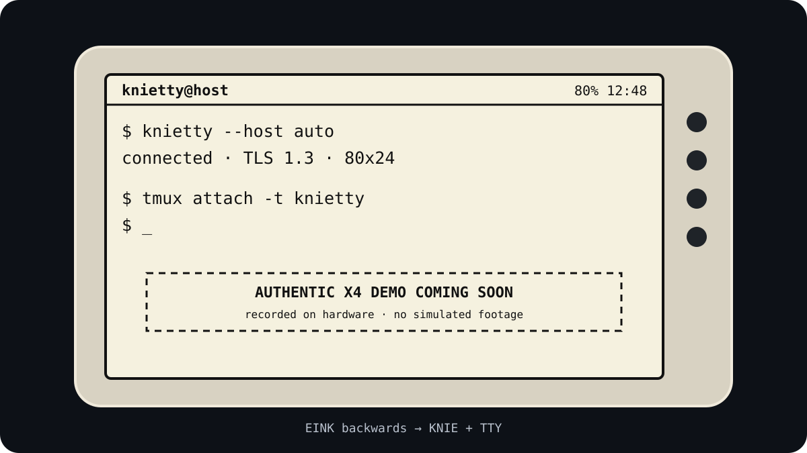

<div align="center">

# knietty

### A real terminal for your E Ink reader.

Turn an **XTEINK X4** into an encrypted, wireless **99 x 28 terminal** for
shells, tmux, SSH, development tools, and text-first TUIs—without giving up the
reader firmware underneath it.

**EINK backwards → KNIE + TTY**

[](https://github.com/integerQuant/crosspoint-reader/releases/latest)
[](#compatibility)
[](#secure-by-default)
[](LICENSE)

[Install](#quick-start) · [How it works](#how-it-works) · [Commands](#useful-commands) · [Development](#development) · [Credits](#lineage-and-credits)

</div>

---

> [!NOTE]
> knietty is an independently maintained community fork of
> [CrossPoint Reader](https://github.com/crosspoint-reader/crosspoint-reader).
> It is not an official CrossPoint release and is not affiliated with Xteink.

knietty is a focused fork of
[CrossPoint Reader](https://github.com/crosspoint-reader/crosspoint-reader). It
adds a terminal Activity to the existing reader, a portable Rust host bridge,
LAN discovery, first-pair approval, persistent TLS identities, a compact VT
screen model, and an X4-specific fast-refresh pipeline.

Open Terminal from the CrossPoint menu, connect from your computer, and your
shell appears on the E Ink panel. Exit Terminal and the X4 returns to being a
reader.

## Demo

<p align="center">
  
</p>

<!--
Replace the placeholder with a short inline GIF linked to the full recording:

<p align="center">
  <a href="FULL_H264_MP4_URL">
    
  </a>
</p>
-->

## What's different from CrossPoint

- **99 x 28 fixed-cell terminal** using Terminus, with ANSI/VT behavior tuned
  for shells, tmux, Codex, Claude Code, OpenCode, and full-screen TUIs such as
  btop. The 2,046-glyph table includes box drawing, blocks, Braille, arrows,
  mathematics, and symbols used by modern agent harnesses.
- **Responsive E Ink updates** through dirty-region rendering, burst-aware
  batching, adaptive SSD1677 waveforms, and asynchronous display work.
- **Zero-configuration discovery** on a shared local network—no fixed IP
  address or USB serial device required.
- **TLS 1.3 by default.** The host and X4 display the same six-digit code on
  first pairing, then pin each other's identity for later reconnects.
- **Portable Rust host** with PTY sizing, tmux/shell fallback, clean signal
  handling, reconnect support, and no Python runtime.
- **Reader-safe integration.** Terminal is an ordinary CrossPoint Activity;
  deliberate exit returns to the menu and normal reader sleep behavior.
- **Observable display pipeline** with safe clean, polarity, status, metrics,
  heap monitoring, and physically approved bounded diagnostic commands.

Everything outside Terminal remains recognizably CrossPoint: its reader,
library, settings, updater, storage model, and Activity lifecycle stay in place.
For the underlying reader feature set and documentation, see the
[upstream project](https://github.com/crosspoint-reader/crosspoint-reader).

## Compatibility

| Layer | Current support |
| --- | --- |
| Firmware | XTEINK X4 with an 800 x 480 SSD1677 panel |
| Host | Apple silicon macOS, generic x86-64 Linux, and x86-64 Arch Linux |
| Network | Host and X4 on the same IPv4 LAN; local discovery must not be blocked |
| Session | POSIX shell, tmux, SSH, and terminal applications through a PTY |

The physical release gate covers an X4 paired with Apple silicon macOS. Linux
and Arch artifacts pass their native software matrices, but that does not by
itself establish hardware parity.

## Quick start

### 1. Install the firmware

> [!CAUTION]
> knietty firmware currently targets the **XTEINK X4**. Keep a known-good
> official CrossPoint image and verify your recovery path before installing
> experimental firmware. Do not alter the bootloader, partitions, eFuses, or
> secure-boot state.

Download `knietty-0.1.3.bin` and its adjacent `.sha256` file from the
[latest release](https://github.com/integerQuant/crosspoint-reader/releases/latest),
verify the checksum, copy the application image to the SD card, and select it
through CrossPoint's normal in-application firmware updater.

For a USB-locked X4, start from a working official CrossPoint installation and
use that SD update path. Do **not** use `esptool` or the Xteink Unlocker to flash
knietty. The release asset is application firmware, not a complete flash image.

### 2. Install the host

The installer downloads the matching release archive, verifies its SHA-256
checksum, and installs `knietty` to `~/.local/bin`. It does not use `sudo`, edit
your shell configuration, run a daemon, or flash the X4.

```sh
curl -fsSL https://rmtb.dev/knietty | sh
```

Install a specific release when reproducibility matters:

```sh
curl -fsSL https://rmtb.dev/knietty | sh -s -- --version 0.1.3
```

Make sure `~/.local/bin` is on `PATH`, then verify the install:

```sh
knietty --version
```

### 3. Connect

Connect the computer and X4 to the same Wi-Fi network, open **Terminal** on the
X4, and run:

```sh
knietty list
knietty --host auto
```

On the first connection, compare the six-digit code printed by the host with
the code on the X4. Press Confirm only when they match. knietty creates or
attaches a tmux session when tmux is available and otherwise starts your shell.

`Ctrl+C` is forwarded to the remote PTY. `Ctrl+\` exits the local bridge and
restores the host terminal.

## Useful commands

| Command | Purpose |
| --- | --- |
| `knietty list` | Discover X4 terminals on the LAN |
| `knietty --host auto` | Connect to the only discovered terminal |
| `knietty --host auto --reconnect` | Return to discovery after a disconnect |
| `knietty display status` | Read firmware, network, geometry, and profile state |
| `knietty display metrics --json` | Read host and display-pipeline counters |
| `knietty display heap --json` | Read current, minimum, and phase-specific device heap |
| `knietty display monitor --interval 2 --count 30` | Record low-overhead heap snapshots as JSONL |
| `knietty display clean` | Schedule one safe ghost-cleaning refresh |
| `knietty display polarity inverted` | Switch to light-on-dark terminal rendering |
| `knietty display polarity normal` | Return to dark-on-light rendering |
| `knietty diagnose --host auto --suite smoke` | Run a bounded, physically approved display test |

Display controls operate through the already connected foreground bridge. They
do not expose raw controller registers or unsafe voltage, OTP, or arbitrary
clock controls.

## How it works

```text
shell / tmux
     ↕ PTY
knietty Rust host
     ↕ TLS 1.3 over Wi-Fi
XTEINK X4
     ↕ terminal parser + 99 x 28 cell model
CrossPoint renderer
     ↕ dirty windows + adaptive waveform
SSD1677 E Ink panel
```

The host sends terminal output in bounded frames and marks logical burst
boundaries. Firmware parses those bytes while display work is in flight,
coalesces changes into the newest screen state, redraws only affected regions,
and periodically performs stronger maintenance updates to contain ghosting.

This is still E Ink: it excels at code, shells, logs, dashboards, and deliberate
interaction—not animation or video. Large TUI repaints are intentionally
batched into coherent updates.

## Secure by default

Terminal traffic and approval messages use mutually authenticated TLS 1.3.
Each installation creates a persistent P-256 identity. The first physical
approval pins the host on the X4 and the device on the host; future connections
from that pair can reconnect without repeating approval.

Discovery remains plaintext and advertises only presence, addressing, and the
TLS requirement. Private host state is stored with owner-only permissions in:

- macOS: `~/Library/Application Support/knietty/`
- Linux: `${XDG_CONFIG_HOME:-~/.config}/knietty/`

The X4 has no secure element, so physical flash extraction is outside the
project's threat model.

## Development

Clone the firmware and its knietty display-driver fork together:

```sh
git clone --recursive https://github.com/integerQuant/crosspoint-reader.git
cd crosspoint-reader
```

Run the complete Rust host gate:

```sh
./host-rs/scripts/check.sh
```

Build the hardware-tested firmware profile:

```sh
pio run -e knietty_async_window
```

Build all release artifacts locally, including native, Ubuntu, Arch, and X4
firmware gates:

```sh
scripts/build-knietty-release-local.sh
```

More detail lives in the [knietty technical guide](docs/knietty.md), the
[Rust host guide](host-rs/README.md), and the
[milestone handoff](docs/knietty-handoff/README.md).

## Project status

The current release is **knietty 0.1.3**. Intel macOS, Linux ARM, and musl Linux
do not yet have release artifacts. The host can still be built from source
where Rust and its dependencies support the platform.

BLE keyboard input is not included in 0.1.3. Early experiments could not retain
a safe contiguous-heap margin alongside Wi-Fi, TLS, CrossPoint, and the terminal
framebuffer, so BLE experiment images are deliberately excluded from releases.

## AI-assisted development disclosure

knietty has been developed with **OpenAI Codex** as an AI coding collaborator.
Codex has assisted with firmware and display-driver implementation, the Rust
host, tests, debugging, research, and documentation. Project direction,
acceptance decisions, release authorization, and physical X4 validation remain
human-controlled by [integerQuant](https://github.com/integerQuant).

AI assistance is not treated as hardware evidence: measured behavior is
reported only when it was observed on the physical device or an explicitly
identified host platform. This project is not sponsored or endorsed by OpenAI.

## Lineage and credits

knietty stands on a substantial open-source foundation:

- [CrossPoint Reader](https://github.com/crosspoint-reader/crosspoint-reader),
  created by Dave Allie and developed by its contributors, provides the reader,
  Activity/navigation model, rendering stack, storage, networking, updater,
  power management, and most of the firmware around Terminal.
- [FreeInk SDK](https://github.com/Free-Ink/freeink-sdk) provides the hardware
  and display abstraction. The [knietty FreeInk fork](https://github.com/integerQuant/freeink-sdk)
  carries the X4 refresh-pipeline changes used here.
- FreeInk's X4 panel work descends from the MIT-licensed
  [OpenX4 E-Paper Community SDK](https://github.com/open-x4-epaper/community-sdk),
  including SSD1677 driver and waveform work by CidVonHighwind and the wider
  OpenX4 community.
- The default terminal face is
  [Terminus Font](https://terminus-font.sourceforge.net/) by Dimitar Toshkov
  Zhekov, distributed under the SIL Open Font License. Complete font notices
  are preserved in [TerminalFonts-LICENSES.md](src/terminal/TerminalFonts-LICENSES.md).

Please support and contribute fixes upstream when they belong there. This fork
is not affiliated with Xteink or any device manufacturer.

CrossPoint, FreeInk, and knietty are distributed under the [MIT License](LICENSE).
